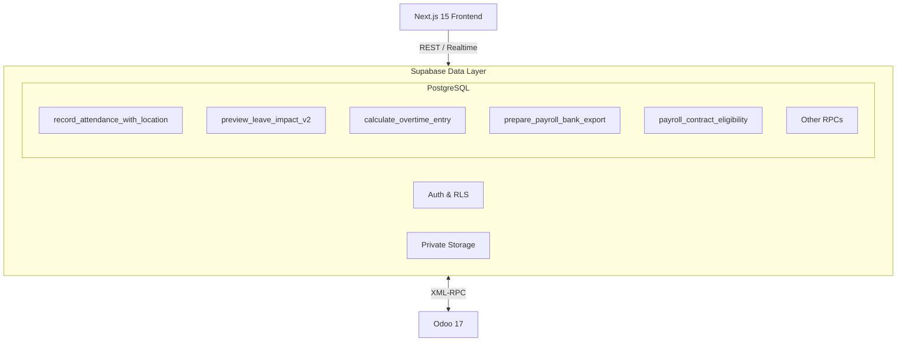

# PayProof

**Every rupee provable before payday.**

PayProof is an Odoo-integrated HR and payroll platform that catches payroll errors and fraud before disbursal, and explains every rupee of an employee's salary in their own language.


*Note: See the "What's real vs what's stubbed" section below for the current implementation state of all features.*

## The problem

- Payroll errors discovered only after bank transfer → reprocessing costs ₹800–₹2,000 per reversal
- Employees cannot verify their own salary → HR fields 40+ queries per payroll cycle
- No single audit trail connecting attendance, leave, and payslip → compliance gaps during labour inspections
- Statutory rules (PF/ESI/PT/TDS) hard-coded in spreadsheets → wrong deductions when slabs change

## How PayProof is different

### Odoo-native integration
XML-RPC to hr.employee, hr.contract, hr.leave, hr.payslip, hr.payslip.line; two-way sync.
*Example: When HR creates a contract in Odoo, PayProof pulls it via XML-RPC and links it to the employee's attendance schedule within the same transaction.*

### Pre-payment risk engine
Readiness score + fraud checks: duplicate bank accounts, ghost employees, statistical salary outliers, duplicate payslips. Metric: "rupees flagged before disbursal".
*Example: Before August payroll of ₹32,00,000 disbursal, the engine flags ₹1,45,000 across 3 employees — one duplicate bank account shared with a terminated employee, one salary 4.2σ above department median, one payslip generated twice.*

### Explainable payslip with statutory rule citations
PF/ESI/PT/TDS as effective-dated rules-as-code; every payslip line links to the rule version that produced it.
*Example: Payslip line "EPF Employee — ₹1,800" links to rule PF-2024-v3 (effective 2024-04-01): 12% of min(Basic, ₹15,000).*

### Payroll Impact Simulator
What-if on salary rules, department cost delta, affected employees, no change to live payroll.
*Example: Payroll manager simulates increasing DA from 18% to 22%. Simulator shows: 142 employees affected, monthly cost rises by ₹4,26,800, Engineering dept +₹1,89,200.*

## Grounded salary copilot

All amounts are computed deterministically by the payroll engine. The LLM only phrases the pre-computed JSON and cannot invent numbers. Available in English, Hindi, and Tamil.

*Example:*
**Engine JSON:** `{"basic": 40000, "hra": 20000, "lwp_days": 2, "lwp_deduction": 4000, "net": 56000}`
**Natural Language (English):** "Your net pay is ₹56,000. This includes ₹40,000 Basic and ₹20,000 HRA, minus a ₹4,000 deduction for 2 days of leave without pay."

## Tamper-evident payroll ledger

Hash-chained payslip versions and audit trail. Every payslip version carries a SHA-256 hash of its content and the previous version's hash, ensuring the integrity of historical payroll records.

## Architecture



## Roles and permissions

| Role | Main permissions |
|---|---|
| Employee | Attendance, leave requests, payslips, salary details, and personal profile |
| HR Manager | Employee, contract, schedule, attendance, leave, and request management; no payroll administration |
| HR Payroll User | HR Manager access plus create, read, and update access to payruns and payslips; salary structures and rules are read-only |
| HR Payroll Manager | Full payroll management, including payruns, draft payslips, salary structures, and salary rules |
| Admin | Complete access to users, permissions, HR, attendance, leave, payroll, reports, integrations, and audit history |

*Note: Employee Self-Service allows employees to independently manage their own profiles, attendance, and leave requests.*

## Getting started

Prerequisites: Node.js 20+, npm/pnpm/yarn/bun, Supabase CLI. Optional: Odoo 17 instance.

1. Clone the repository and install dependencies:
```bash
git clone https://github.com/sujancse645/123.git
cd PayProof
npm install
```

2. Create a `.env` file with the following environment variables:
```env
NEXT_PUBLIC_SUPABASE_URL=
NEXT_PUBLIC_SUPABASE_ANON_KEY=
SUPABASE_SERVICE_ROLE_KEY=
SUPABASE_SECRET_KEY=
BANK_DATA_ENCRYPTION_KEY=replace_with_a_long_random_secret
NEXT_PUBLIC_APP_URL=http://localhost:3000
NEXT_PUBLIC_DEMO_COMPANY_ID=00000000-0000-0000-0000-000000000001
ALLOW_DEMO_SEED=false
DEMO_COMPANY_NAME=PayProof Demo Private Limited
DEMO_DEFAULT_PASSWORD=PayProof@360
EMAIL_PROVIDER=console
EMAIL_DELIVERY_WEBHOOK_URL=
EMAIL_DELIVERY_WEBHOOK_SECRET=
GMAIL_CLIENT_ID=
GMAIL_CLIENT_SECRET=
GMAIL_REFRESH_TOKEN=
EMAIL_FROM=
ODOO_URL=https://your-instance.odoo.com
ODOO_DB=your_database
ODOO_USERNAME=api_user@example.com
ODOO_API_KEY=your_odoo_api_key
```

3. Run migrations in the following order:
- `20260905120000_payproof_compatibility_extensions.sql`
- `20260905121000_payproof_atomic_workflows.sql`
- `20260905122000_payproof_rls_views.sql`
- `20260905123000_payproof_calculation_rpcs.sql`
- `20260905124000_payproof_work_schedule_rpc.sql`
- `20260905130000_payproof_missing_features.sql`
- `20260905140000_payproof_account_lifecycle.sql`
- `20260906100000_payproof_biometric_contract_payroll.sql`
- `20260906110000_demo_mailbox_compatibility.sql`
- `20260906120000_profile_photos_bucket_compatibility.sql`

4. Generate TypeScript types and run regression tests:
```bash
npm run db:types
# Run pgTAP tests in Supabase
```

5. To connect to Odoo, update the `ODOO_*` variables in your `.env` file with your instance details.

6. Start the development server or build for production:
```bash
npm run dev
# or
npm run build
```

## Demo script

1. **0:00–0:30** — Login as employee, show dashboard
2. **0:30–1:00** — Check in, view attendance
3. **1:00–1:30** — Request leave exceeding paid balance, see salary impact preview with ₹ amounts
4. **1:30–2:00** — Switch to HR Manager, approve leave, create payrun
5. **2:00–2:30** — View payroll readiness score, review warnings
6. **2:30–3:00** — Open payslip, show explainable salary breakdown with rule citations
7. **3:00–3:30** — Show audit trail, PDF download
8. **3:30–4:00** — Open Payroll Impact Simulator, simulate DA increase, review cost delta

## What's real vs what's stubbed

| Capability | Status |
|---|---|
| Supabase Auth + RLS (5 roles) | Shipped. Server-side session, role-checked RPCs, row-level policies. |
| Attendance with geofence + location verification | Shipped. RPC `record_attendance_with_location` computes Haversine distance. |
| Leave impact preview with sandwich-leave detection | Shipped. RPC `preview_leave_impact_v2` with policy lookup. |
| Overtime calculation | Shipped. RPC `calculate_overtime_entry` with policy caps and rounding. |
| Loan payment ledger (immutable) | Shipped. Trigger-enforced append-only `loan_payments` table. |
| Contract lifecycle management | Shipped. RPCs `refresh_contract_statuses`, `assign_employee_contract`, `payroll_contract_eligibility`. |
| Bank export preparation | Shipped. RPC `prepare_payroll_bank_export` with SHA-256 checksum. |
| Salary structure template validation | Shipped. RPC `validate_salary_template_version` with circular-dependency detection. |
| Work schedule creation | Shipped. RPC `create_work_schedule` with segments. |
| PDF payslip generation + signed download | Shipped. A4 PDF with SHA-256 file checksum. |
| Payroll readiness UI | Frontend only. Scores are hardcoded (85/88/100), not computed from data. |
| Explainable salary difference UI | Frontend only. Static modal with fixed values. |
| Payroll Impact Simulator UI | Frontend only. DB tables exist, no backend simulation RPC. |
| Odoo XML-RPC integration | Not started. No XML-RPC client in codebase. Service layer ready for connection. |
| Pre-payment fraud checks | Not started. No duplicate-bank, ghost-employee, or outlier detection logic. |
| Statutory rule versioning (PF/ESI/PT/TDS) | Partial. PF calculation exists in mock JS. No effective-dated rule engine or version linkage on payslip lines. |
| Grounded salary copilot (LLM) | Not started. `@google/genai` in package.json but unused. No Hindi/Tamil generation. |
| Hash-chained payslip versions | Not started. Individual PDF checksums exist. No inter-record hash chain. |
| Email delivery | Webhook adapter built. No provider credentials configured. |
| pgTAP regression tests | Shipped. 16 assertions across RLS policies and encrypted columns. |
| Vitest domain + service tests | Shipped. 4 test suites covering leave, overtime, loans, contracts. |

## Tech stack, project structure, team, license

**Tech Stack:** Next.js 15, React 19, TypeScript, Tailwind CSS 4, shadcn/ui, Supabase (Postgres + Auth + Storage), Recharts, Framer Motion, jsPDF, Vitest, pgTAP, Zod.

**PayProof Design System:**
Inspired by Odoo's plum palette.

| Purpose | Color |
|---|---|
| Primary plum | #714B67 |
| Deep plum | #4D3348 |
| Muted lavender | #A4879F |
| Warm yellow | #F4C430 |
| Warm white | #FBFAFB |
| Surface white | #FFFFFF |
| Border grey | #E4E1E5 |
| Primary text | #28262D |
| Success | #438A6B |
| Warning | #D49525 |
| Error | #C85A54 |

**Project Structure:**
```text
app/                         Next.js routes and layouts
components/
├── admin/                  Audit trail, role matrix, config
├── application/            Main app shell
├── attendance/             Check-in/out, verification
├── auth/                   Login, enrollment pages
├── brand/                  Logo component
├── dashboard/              KPI cards, charts
├── hr/                     Employee, contract, schedule management
├── leave/                  Leave request and impact preview
├── loans/                  Employee loan management
├── payroll/                Payruns, payslips, simulation, reports
├── payslips/               Payslip detail, bulk email, breakdown
├── profile/                Employee profile
├── shared/                 Reusable navigation, dialogs, tables
└── shell/                  Sidebar, breadcrumbs, role switcher
hooks/                       Reusable React hooks
lib/
├── auth/                   Demo credentials
├── context/                App-wide state (AppContext)
├── demo/                   Local fallback storage
├── domain/                 Business logic + tests
├── exports/                PDF/CSV generation
├── mock-data/              Demonstration records
├── payslips/               Payslip PDF builder
├── server/                 Server-only utilities (encryption)
├── services/               Replaceable service layer + tests
├── supabase/               DB types, query helpers
├── types/                  TypeScript domain interfaces
└── utils.ts                Formatting helpers
scripts/                     Seed and reset scripts
sql/                         Legacy bootstrap SQL
supabase/
├── migrations/             Ordered migration files
├── seed.sql                Demo seed data
└── tests/                  pgTAP regression tests
```

**Team:**
| Member | Responsibility |
|---|---|
| Team Member 1 | Project lead and integration |
| Team Member 2 | Employee and attendance experience |
| Team Member 3 | Leave and HR workflows |
| Team Member 4 | Payroll and salary explanation |
| Team Member 5 | Dashboards and reports |
| Team Member 6 | Testing, documentation, and demo |

License: MIT

**PayProof — Every rupee provable before payday.**
