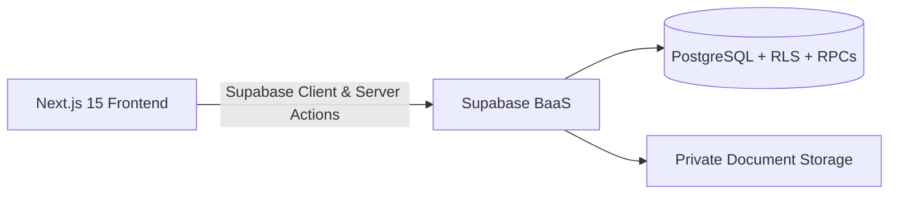

# PayProof

> **Every rupee provable before payday.**

PayProof is an intelligent HR and payroll verification platform that catches errors, anomalies, and fraud before disbursal, ensuring transparent and provable salary calculations.

[](https://nextjs.org/)
[](https://www.typescriptlang.org/)
[](https://supabase.com/)
[](LICENSE)

---

## Key Features

- **Pre-Payment Risk Checks**: Flags duplicate bank accounts, ghost profiles, and salary anomalies before disbursal.
- **Explainable Salary Breakdown**: Clear, transparent computation for every earnings and deduction item (PF, ESI, PT, TDS, unpaid leave).
- **Payroll Impact Simulator**: What-if preview mode to model allowance changes and departmental budget impact before applying updates.
- **Auditable & Immutable Records**: Append-only transactional ledger for loan repayments and SHA-256 verified document exports.
- **Role-Based Workspaces**: Tailored self-service and management portals for Employees, HR Managers, Payroll Users, and Admins.

---

## Tech Stack

- **Framework**: Next.js 15 (App Router), React 19, TypeScript
- **Styling & UI**: Tailwind CSS, shadcn/ui, Lucide React, Framer Motion
- **Data & Auth**: Supabase (PostgreSQL, Row-Level Security, Database RPCs)
- **Exports**: jsPDF, CSV generation
- **Testing**: Vitest & pgTAP regression suites

---

## Quick Start

### 1. Clone & Install

```bash
git clone https://github.com/sujancse645/123.git
cd PayProof
npm install
```

### 2. Environment Setup

Create `.env.local` using `.env.example`:

```env
NEXT_PUBLIC_SUPABASE_URL=your_supabase_url
NEXT_PUBLIC_SUPABASE_ANON_KEY=your_supabase_anon_key
SUPABASE_SERVICE_ROLE_KEY=your_service_role_key
BANK_DATA_ENCRYPTION_KEY=your_encryption_secret
```

### 3. Database Migrations

Apply the migration scripts in `supabase/migrations/` sequentially or via Supabase CLI:

```bash
npm run db:types
```

### 4. Run Development Server

```bash
npm run dev
```

Visit [http://localhost:3000](http://localhost:3000) to view the application.

---

## Architecture



---

## License

MIT License.
